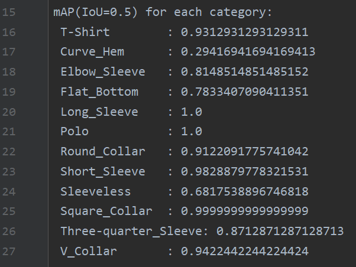
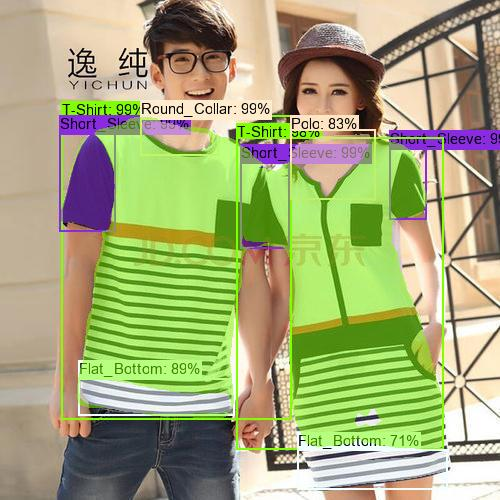
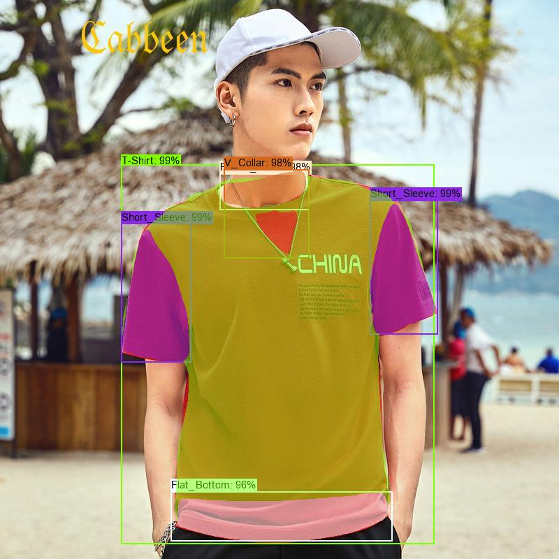

# T-shirt-Attribute-Recognition-Based-on-Mask-R-CNN

本项目基于pytorch版本的Mask R-CNN来做T恤的属性识别。

#### T恤数据集的构建

##### 标注种类

总共12类，标注T恤图片的廓形（袖型、领型、下摆、中间衣长区域）

```
"1": "T-Shirt",
"2": "Curve_Hem",
"3": "Elbow_Sleeve",
"4": "Flat_Bottom",
"5": "Long_Sleeve",
"6": "Polo",
"7": "Round_Collar",
"8": "Short_Sleeve",
"9": "Sleeveless",
"10": "Square_Collar",
"11": "Three-quarter_Sleeve",
"12": "V_Collar",
```

##### 标注形式

用labelme标注，生成JSON文件，再用labelme官方GitHub仓库里的工具（见labelme2coco文件夹）转成coco数据集格式。

##### 标记数量与训练集验证集

总计176张图片，其中 train：143  val:     33 以8:2进行shuffle分割（见train_test_split.py文件分割方式），同要保证train与val里都包含12个类

图片大小：resize：800 * 1333, 

#### 训练

实验平台：windows11,3050ti（4GB显存）,pytorch

batch_size = 1；lr=0.0001；epochs=30；优化器adam

还采用了torch.optim.lr_scheduler.MultiStepLR来手动根据epoch调整参数

绘制loss与lr曲线如下：


#### 评测

采用 PASCAL VOC 2012 competition 中定义的 mAP 标准

利用pycocotools工具计算IOU=0.5时的map如下图：


各个种类的AP:



#### 测试

随机从val数据集中拿出两张图片进行推理，测试结果如下：





#### 实验分析

1.由各种种类AP可以发现，Curve_Hem是AP值是最低的。

分析原因，下摆有Flat_Bottom与Curve_Hem两类。观察图片数据发现，有些T恤下摆特征不明显，不好区分，以致标注时没有准确标注。模型预测这类分类能力下降。

2.由测试结果可以发现，图一两人的袖子重叠在一起，但只检测出一个人的袖子。图二的模特由于带了项链，虽然检测出来是圆领，但也产生了V领的误判。

#### 展望

1.扩充数据集，构建数据量更大的数据集，同时细化分类，避免一些歧义类别。

2.针对遮挡，重叠问题，考虑解决。在查阅了大量文献，得出一个有效的解决方案：利用服装关键点信息辅助特征提取，即先进行T恤的关键点检测，准确检测出所有关键点，无论是遮挡还是重叠情况。**这也是我接下来的研究课题**

3.由本小数据集可以发现，由于衣服种类的多种多样，以及常见性，使得种类的数量产生了差异，即有数据不均衡的情况发生，在构造大数据集后可能也会不可避免的产生数据不均衡。这也是优化的一个点。

4.不多说，利用更sota的模型，提高基础性能。

